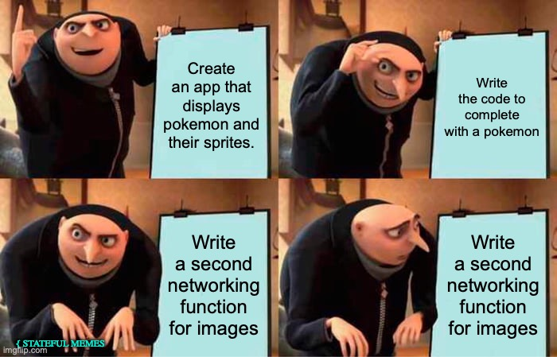

# Pokedex
In this project, you will use your knowledge of Swift and Networking to build an app that displays the search results for Pokemon! Gotta parse em’ all!

Students who complete this project independently or as a pairing will showcase their understanding of the following principles:

* Basic Storyboard constraints
* UITableviews
* Creating Custom `class` objects
* Constants, Variables, and Basic Data Types
* Collections
* Functions
* Control Flow
* IBActions && IBOutlets
* API Calls
* API Documentation


---

##  Before you begin
Please `Fork` then `clone` the repo. You can access the repo here:
https://github.com/Stateful-Academy/Pokedex

Create a local branch named `starter` and track the remote branch `starter`. 

To do this:
 * Open `Terminal`
 * Navigate to the correct `directory`
 * Type `git checkout --track origin/starter` 
	 * Hype

---


## Design
If you build and run the app now that you are on the `starter` branch you will discover that we’ve created the UI for this project for you. We made this decision to allow you to focus on the networking code required. Take a moment and explore the project and how the Interface is set up. Some items to be on the lookout for are:

*  Are all the files `subclassed` properly?
* Are all the `IBOutlets` connected properly?
* How is that `tableView` on a `ViewController`?

Warning: There are some setup steps that we’ve intentionally left undone which the instructions will not inform you how to fix. Though, might not be able to fix them at this time.

___

## API Docs
When you are building an app that will display data from an API; that API will determine the properties of your model. Before you ever create the file for your `Model` You need to familiarize yourself with the documentation provided. 

The API we will be using for today's project is provided byby  [Paul Hallett](https://phalt.github.io/)  and other  [PokéAPI contributors](https://github.com/PokeAPI/pokeapi#contributing)  around the world. Thank you!!

You can access the documentation via this link:
[Documentation - PokéAPI](https://pokeapi.co/docs/v2)

Specifically the `Pokemon` endpoint
[Documentation - PokéAPI](https://pokeapi.co/docs/v2#pokemon)

A few things to discover when looking at API documentation:
* Is it free?
* What type of `Authorization` does it require?
* Does it return JSON 😨
* What does the URL look like?

## Testing the URL in Postman

Within the application Postman, make a new `Collection` and name it `Pokemon`. 
Create a new `request` and test the url provided by the docs

Ask yourself the following questions:
* Does this need `component`s or `query` items?
* What information will the user need to provide for me to search for a specific `Pokemon`?

---

### Reading the data on Postman
Take a few moments and explore the `nesting`  and structure of the JSON data you will receive from the request you just completed. On the line numbers, there are arrows that will allow you to collapse the structures. 

Our goal for this app is to display the following data:
* Pokemons Name
* Pokemons ID
* A image for the Pokemon
* A list of ALL the moves available to the Pokemon

Review the documentation and Postman to discover *how* you will navigate through the JSON layers to gain access to the data we need.

How many network calls will we need to write? 🤔

---


## Model
* Create a new `.Swift` file with the name `Pokemon`.
* Create a new class named `Pokemon`
* Add the following parameters:
	1. name
	2. id
	3. moves
		1. Take note that this is `plural`
	4. spritePath

Review the API Docs and Postman to determine what values these `constants` should have.

### Fail able Initializer

Our goal is to create the model `Pokemon` objects using the values received from a network call. With that in mind, think through what could go wrong. 

The user could lose network access; the API could be down; you could receive a bad request… The list goes on. The opportunity for something to `fail` is too great to create our objects using the traditional member-wise initializer. This is why we create an initializer that can `fail` gracefully. 

If for some reason you cannot initialize a value for some reason it will not complete the initialization and return a `nil` value, rather than crashing the app.

To build our Fail-able Initializer on the `Pokemon` class file, we need to:
1. Declare an init with a `?`
	1. `init?` - this is what allows it to fail.
2. Give this `fail able member-wise initializer` one parameter
	1. A `dictionary` 
		1. Declare the type

Within the body of this  `fail able member-wise initializer,` we will `parse`, or navigate to the values we need. 

Remember - all the data we want is locked in little `Collection` boxes. All we need to do is open them one step at a time. 

`quard` that we can `optionally typecast` the values as the types we expect. Have all of the following under the same `guard` statement.

1. `name`and using Subscript Syntax assign the value of the associated key
	1. Optionally typecast this as the type it is via the docs / Postman
2. `id`and using Subscript Syntax assign the value of the associated key
	1. Optionally typecast this as the type it is via the docs / Postman

We need to parse down an additional level(s) to gain access to the `spritePath` and the `moves` 

3. Starting with the goal of accessing the sprites…
	1. create a constant named `spriteDict`and using Subscript Syntax assign the value of the associated key
		1. Optionally typecast this as the type it is via the docs / Postman
	2. Create a constant named `spritePosterPath` and using Subscript Syntax assign the value of the key `front_shiny` from the `spriteDict` you just unwrapped.
		1. Optionally typecast this as the type it is via the docs / Postman
		2. Of course we will be using the `Shiny` images… who would we want the normal version? 🤮

4. Moving on to accessing our moves..
	1. create a constant named `movesArray`and using Subscript Syntax assign the value of the associated key
		1. Optionally typecast this as the type it is via the docs / Postman
		2. Hint - this is an array of dictionaries.
	2. End the `guard` statement you began earlier with `else {return nil}`

Okay, now we have all the data that we can access without additional logic.

To finally gain access to our `moves` we need to access `each` ~dictionary~ in the `movesArray`. Once we have access to the single `moveDictionary` we can then grab the `name` for the move. We will need to place these `move` objects into a temporary collection so we can use them outside the scope of the `for-in` we will be using…

To accomplish the goals we just laid out please:
1. Create a temporary location to hold the `name` String(s) once we have them.
2. Write a `for - in ` loop to loop through the `movesArray` and access each `dict` one at a time. Within the body of the `for-in` loop:
	1. Guard that you can create a `movieDict`and using Subscript Syntax assign the value of the associated key
		1. Optionally typecast this as type it is via the docs / Postman
3. Create a constant named  `moveName`and using Subscript Syntax assign the value of the associated key
	1. Optionally typecast this as type it is via the docs / Postman
4. End the `guard` statement you began earlier with `else {return nil}`
5. Add the `moveName` to the temporary location you created earlier

Now all you need to do is assign the proper values to the properties on `self`

<details>
  <summary>Check your work</summary>
  
  
``` swift
let name: String
    let id: Int
    let moves: [String]
    let spritePath: String
    
    init?(dictionary:[String:Any]) {
        guard let name = dictionary[Keys.name.rawValue] as? String,
              let id = dictionary[Keys.id.rawValue] as? Int,
              let spriteDict = dictionary[Keys.sprites.rawValue] as? [String:Any],
              let spritePosterPath = spriteDict[Keys.frontShiny.rawValue] as? String,
              let movesArray = dictionary[Keys.moves.rawValue] as? [[String:Any]] else {return nil}
        
        var moves: [String] = []
        
        for dict in movesArray {
            guard let moveDict = dict[Keys.move.rawValue] as? [String:Any],
                  let moveName = moveDict[Keys.name.rawValue] as? String else {return nil}
            
            moves.append(moveName)
        }
        
        self.name = name
        self.id = id
        self.moves = moves
        self.spritePath = spritePosterPath
        
    }
```
</details>


Great work! The model is now complete. Build, run, commit, and take a break.

___


## Networking Controller
Create the `Network Controller` file and `class`.
___

### Complete the Fetch Function and Build the URL
You know what to do 😉 

1. First, we need to decide what we want the `fetch` function to complete. Because this function will be responsible for hitting an `API Endpoint`, we know it will need a completion handler. 
2. Then, we need to piece together our URL. 
3. Once we have a `finalURL` we will pass that into the `dataTask(with: _, completion: )` function. This will `complete` with a `response` and either an `error` or `data`. 
4. If we are successful in retrieving data from the `dataTask` we will then need to decode that `data` into our objects. 
5. Completion?

With our goals laid out let’s start building this piece by piece.

#### Completion - Fetch
When deciding what your closures should complete you should consider *how* you want to use the data. Do you want to have a single object available with the task is done? Maybe you want an `array` of objects instead… Would you rather not have any objects, but just a `Bool` that tells you where it worked or not? Each has their merits. 

For this project, we have decided it would be best to complete with an `Optional`  `Pokemon` objects. This will complete with a valid `Pokemon` if everything worked.

* Create a `fetchPokemon` function that will have two parameters
1. Named `searchTerm` this is a `String`
2. Named `completion` that is marked as `@escaping` and takes in a `Optional Pokemon` value and will  `return`  Void.

Nice work! Let’s move on to the URL

#### URL Finalized


* Create a `private` and `static` property `above` the declaration of the `fetchPokemon` function. This property will not change and should be named `baseURLString`. 
* Assign the value of the most consistent aspect of the URL as described on the API documentation.

Now, let’s navigate to inside the body of the `fetchPokemon`. To create your `finalURL` we will need to perform the following tasks:

* guard that you can initialize a new URL  named `baseURL`from the `baseURLSTring`
	* else { return }
* Create a new variable named `urlComponents`  and assign the value of a `URLComponents` initialized with a url that also is resolving against the BaseURL.
* call the `path` property of the `urlComponents` and assign it the value of the remaining components for the url.
	* Hint: The `searchTerm` needs to be lowercased to work with the api properly.
<details>
  <summary>How do I write this?</summary>
  
  ```swift
     guard let baseURL = URL(string: baseURLString) else {return}
        var urlComponents = URLComponents(url: baseURL, resolvingAgainstBaseURL: true)
        urlComponents?.path = "/api/v2/pokemon/\(searchTerm.lowercased())"

        guard let finalURL = urlComponents?.url else {return}
        print(finalURL)
  ```
</details>

* Guard that you can create a constant named `finalURL` from the optional  `url` property on the `urlComponents`
	* else {return}
* Print out the `finalURL` for testing

Build and run. Commit, and take a 15 min break! We are now 1/3 of the way complete with our `fetchDays(completion: ([Day]?)-> Void)`
___

#### DataTasking

Under the creation of the `finalURL` we will perform a `dataTask` that will  `complete` with a `response` and either an `error` or `data`. If we are successful in retrieving data from the `dataTask` we will then need to decode that `data` into our objects. To accomplish this we need to:

* call the `dataTask(with: URL, completionHandler: (Data?, URLResponse?, Error?) -> Void)` from the `shared` singleton on the `URLSession` class
	* pass in the `finalURL`
	* press `enter` on the autocompleteable aspect of the closure.
		* ( I made that name up, ¯\_(ツ)_/¯ )
	* Immediately head to the closing brace of this method and call `.resume()`
		* The program will not run without this line
	* name each item
		* taskData
		* _
		* error
	* conditionally unwrap an `error`
		* If `true` 
			* print `”"There was an error fetching the data. The url is \(finalURL), the error is \(error.localizedDescription)”`
			* completion(nil)
	* We are going to ignore the `response`
	* guard you can create `pokemonData` from `taskData`
		* else return
		
Okay, this next section will be the most challenging aspect of your Paired Programming Project.
* Declare a Do -> Try -> Catch block
* Within the body of the `do`
	* `if let` a new constant named `topLevelDictionary`
	* assign the value of `try` ing to create a `JSONObject` with the `data` you unwrapped above. This should allow some fragments,  and be `optionally Type Cast` as a Dictionary that holds String keys and any values.
		* `[String:String]`

Within the `true` body of the `if let` you just created:

* Create a constant named `pokemon` and Initialize a `Pokemon`
* complete with the `pokemon`
__

* After the closing brace of the `do`  
	*  `catch`
		*  print `"Encountered error when decoding the data:", error.localizedDescriptio"n`
		* call the completion as nil

Take a well-deserved sigh of relief. We did it! We have now completed the networking code required to hit the `API Endpoint` and parse the data to create our `Pokemon` objects! Well done. 

• A - Always
• B - Be
• C - Committing

Build. Run. Commit. Party. Start a new function.



---

### Image 4rm URL

Under the `fetchPokemon` we will perform a second  `dataTask` that will retrieve the data we need to create an image. To accomplish this we need to:
* Create a `fetchImage` function that will have two parameters
1. Named `searchTerm` this is a `String`
2. Named `completion` that is marked as `@escaping` and takes in a `Optional Image` value and will  `return`  Void.
	1. You will need to Import `UIKit` to declare the proper type.

* call the `dataTask(with: URL, completionHandler: (Data?, URLResponse?, Error?) -> Void)` from the `shared` singleton on the `URLSession` class
	* pass in the `finalURL`
	* press `enter` on the autocompleteable aspect of the closure.
		* ( I made that name up, ¯\_(ツ)_/¯ )
	* Immediately head to the closing brace of this method and call `.resume()`
		* The program will not run without this line
	* name each item
		* data
		* _
		* error
	* conditionally unwrap an `error`
		* If `true` 
			* print `”"There was an error fetching the data. The url is \(finalURL), the error is \(error.localizedDescription)”`
			* completion(nil)
	* We are going to ignore the `response`
	* guard you can create `aata` from `data`
		* else return
		
* Create a new constant named `pokemonImage` and assign the value of a `UIImage` initialized with the `data` you just unwrapped.
* complete with the image
* Did you forget to `.resume()`?

Well done.  Now we’ve finished the Network Controller. Commit.


---

## Wire Up the views
There is only one `View` files you’ll need to complete. We feel that you are getting more and more comfortable with the step of wiring up the views so the instructions for this will be light

## Update the views
* Declare a local optional variable named `pokemon` that has the correct type.
* Declare a `updateViews` function that takes a `Pokemon` as a parameter. Within the body please:
	1. Call the `fetchImage` function from the `Networking Controller`
		1. Guard the `image` from the completion exists
		2. Access the function that will allow us to make UI changes on the main thread
			1. Within the body:
			2. Set the local `pokemon` to the `pokemon` passed into the `updateViews` function
			3. Set the values for the `IBOutlets`
			4. Reload the `pokemonMovesTableView`

### TableView Protocols
Extend the `PokemonViewController` class that was provided to you to adopt and conform to the `UITableViewDelegate and DataSource` protocols.

Complete the required protocol methods. 

Feel free to access the `titleForHeaderInSection` method and return `”moves”`

### SearchBar Delegate
Extend the `PokemonViewController` class that was provided to you to adopt and conform to the `UISearchBarDelegate` protocol.

Find and autocomplete the `textDidChange` protocol method. Within the body we need to:
* Call our `fetchPokemon(searchTerm:)` function from the `NetworkController`
	* Pass in the `searchText` provided by the `textDidChange` function
		* Guard the `pokemon` from the completion exists
		* call the update views functions.

___

Victory? At this time build and run the app. Begin your bug hunt after a cool 15 min break.

___
Found the bugs and everything is golden? Heck yeah! Submit your project.
